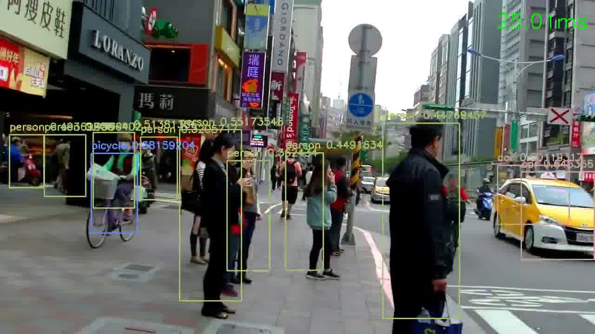
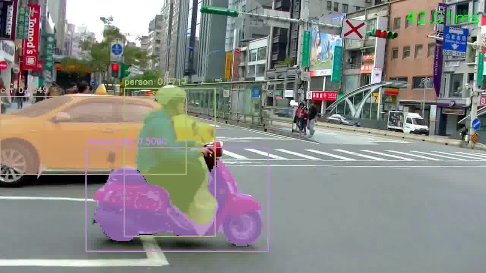

# YOLOv2 tiny Keras with multiple GPU

Features:

- [x] Implment YOLOv2-tiny without Batch Normalization (use Weight Normalization instead)
- [x] Multiscale training 
- [x] Multiple GPU training
- [x] U-Net for simple mask generation
- [x] Apply detection in video file

Demo:

---
Reference:

[1] [YOLO9000: Better, Faster, Stronger](https://arxiv.org/abs/1612.08242)

[2] [keras-yolo2](https://github.com/experiencor/keras-yolo2)

